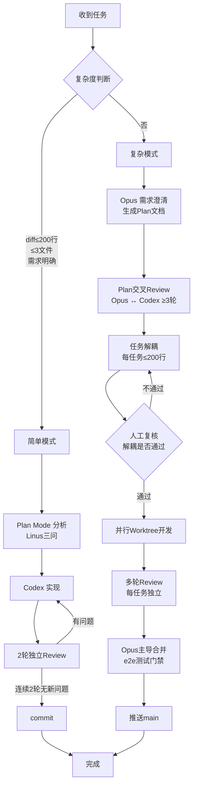
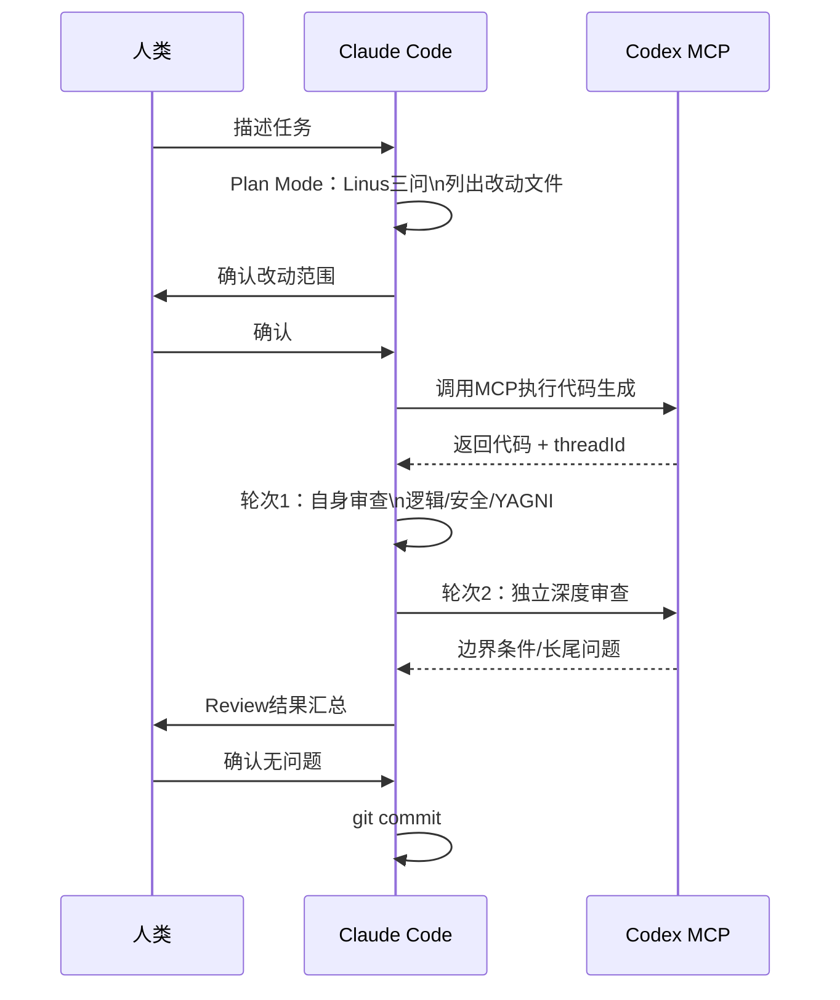
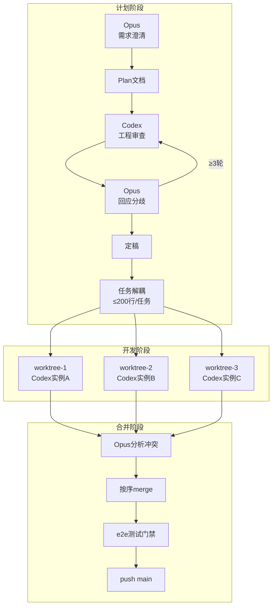

# AI 开发工作流体系

> 基于 Claude Code + Codex MCP 的高质量软件开发规范
> 将 AI 首轮 60-70 分的代码质量，通过结构化流程提升到可交付标准

---

## 核心理念

```
不是让 AI 替代开发者，而是让 AI 做苦力，人做判断
规划 → 人决策    代码生成 → AI执行    质量把控 → 人+AI协作
```

**三条铁律：**
- 单次变更 ≤ 200 行（超了就拆，这是防止 Review 地狱的根本）
- AI 首轮代码必须多轮 Review（每轮只能召回部分问题）
- 计划先于代码（复杂任务不出 Plan 不动手）

---

## 工具角色

<svg xmlns="http://www.w3.org/2000/svg" viewBox="0 0 720 200" font-family="monospace" font-size="13">
<rect width="720" height="200" fill="#0d1117"/>
<rect x="20" y="30" width="200" height="140" rx="8" fill="#1a2332" stroke="#3b82f6" stroke-width="1.5"/>
<text x="120" y="58" fill="#3b82f6" font-weight="bold" text-anchor="middle" font-size="14">Claude Code</text>
<text x="120" y="78" fill="#94a3b8" text-anchor="middle">大脑</text>
<text x="40" y="102" fill="#64748b">✓ 规划 / 决策</text>
<text x="40" y="120" fill="#64748b">✓ 搜索 / Review</text>
<text x="40" y="138" fill="#64748b">✓ Git 操作</text>
<text x="40" y="156" fill="#64748b">✓ 文档</text>
<rect x="260" y="30" width="200" height="140" rx="8" fill="#1a2332" stroke="#10b981" stroke-width="1.5"/>
<text x="360" y="58" fill="#10b981" font-weight="bold" text-anchor="middle" font-size="14">Codex MCP</text>
<text x="360" y="78" fill="#94a3b8" text-anchor="middle">双手</text>
<text x="280" y="102" fill="#64748b">✓ 代码生成</text>
<text x="280" y="120" fill="#64748b">✓ 重构 / 修复</text>
<text x="280" y="138" fill="#64748b">✓ 测试代码</text>
<text x="280" y="156" fill="#64748b">✓ 深度 Review</text>
<rect x="500" y="30" width="200" height="140" rx="8" fill="#1a2332" stroke="#f59e0b" stroke-width="1.5"/>
<text x="600" y="58" fill="#f59e0b" font-weight="bold" text-anchor="middle" font-size="14">Opus (Plan Mode)</text>
<text x="600" y="78" fill="#94a3b8" text-anchor="middle">架构师</text>
<text x="520" y="102" fill="#64748b">✓ 需求澄清</text>
<text x="520" y="120" fill="#64748b">✓ 架构决策</text>
<text x="520" y="138" fill="#64748b">✓ 冲突仲裁</text>
<text x="520" y="156" fill="#64748b">✓ 合并主导</text>
</svg>

---

## 全流程总览



---

## 简单模式流程



---

## 复杂模式架构



---

## Review质量体系

<svg xmlns="http://www.w3.org/2000/svg" viewBox="0 0 700 260" font-family="sans-serif" font-size="12">
<rect width="700" height="260" fill="#0d1117"/>
<text x="350" y="28" fill="#e2e8f0" font-size="15" font-weight="bold" text-anchor="middle">Review轮次与质量提升</text>
<line x1="60" y1="200" x2="640" y2="200" stroke="#334155" stroke-width="1"/>
<line x1="60" y1="50" x2="60" y2="200" stroke="#334155" stroke-width="1"/>
<text x="50" y="204" fill="#64748b" text-anchor="end">60</text>
<text x="50" y="164" fill="#64748b" text-anchor="end">70</text>
<text x="50" y="124" fill="#64748b" text-anchor="end">80</text>
<text x="50" y="84" fill="#64748b" text-anchor="end">90</text>
<text x="50" y="57" fill="#64748b" text-anchor="end">95</text>
<polyline points="60,200 200,160 350,120 500,84 640,64" fill="none" stroke="#3b82f6" stroke-width="2.5"/>
<circle cx="60" cy="200" r="5" fill="#3b82f6"/>
<circle cx="200" cy="160" r="5" fill="#3b82f6"/>
<circle cx="350" cy="120" r="5" fill="#3b82f6"/>
<circle cx="500" cy="84" r="5" fill="#3b82f6"/>
<circle cx="640" cy="64" r="5" fill="#3b82f6"/>
<text x="60" y="220" fill="#94a3b8" text-anchor="middle">首轮</text>
<text x="200" y="220" fill="#94a3b8" text-anchor="middle">轮次1</text>
<text x="350" y="220" fill="#94a3b8" text-anchor="middle">轮次2</text>
<text x="500" y="220" fill="#94a3b8" text-anchor="middle">轮次3</text>
<text x="640" y="220" fill="#94a3b8" text-anchor="middle">轮次4+</text>
<text x="60" y="238" fill="#64748b" text-anchor="middle">AI生成</text>
<text x="200" y="238" fill="#64748b" text-anchor="middle">CC审查</text>
<text x="350" y="238" fill="#64748b" text-anchor="middle">Codex深审</text>
<text x="500" y="238" fill="#64748b" text-anchor="middle">Dev验证</text>
<text x="640" y="238" fill="#64748b" text-anchor="middle">收敛</text>
<line x1="60" y1="160" x2="640" y2="160" stroke="#ef4444" stroke-width="1" stroke-dasharray="4"/>
<text x="645" y="163" fill="#ef4444" font-size="11">70分</text>
<text x="645" y="84" fill="#10b981" font-size="11">90分</text>
</svg>

| 工具 | Review质量 | 速度 | 推荐用途 |
|------|-----------|------|---------|
| Codex 深度审查 | ⭐⭐⭐⭐⭐ | 慢 | 边界条件、长尾问题 |
| Claude Code | ⭐⭐⭐⭐ | 中 | 逻辑、安全、结合需求验证 |
| Cursor Review Agent | ⭐⭐ | 快 | 不推荐，误报率高 |

---

## 200行约束的意义

<svg xmlns="http://www.w3.org/2000/svg" viewBox="0 0 700 180" font-family="sans-serif" font-size="12">
<rect width="700" height="180" fill="#0d1117"/>
<rect x="20" y="20" width="200" height="140" rx="6" fill="#0f2720" stroke="#10b981" stroke-width="1.5"/>
<text x="120" y="46" fill="#10b981" font-weight="bold" text-anchor="middle">≤ 200行</text>
<text x="120" y="68" fill="#64748b" text-anchor="middle">Review 3轮</text>
<text x="120" y="92" fill="#94a3b8" text-anchor="middle">~30分钟</text>
<text x="120" y="116" fill="#10b981" text-anchor="middle">✓ 可控</text>
<text x="120" y="140" fill="#64748b" text-anchor="middle">问题易定位</text>
<rect x="250" y="20" width="200" height="140" rx="6" fill="#1f1a0f" stroke="#f59e0b" stroke-width="1.5"/>
<text x="350" y="46" fill="#f59e0b" font-weight="bold" text-anchor="middle">500–1000行</text>
<text x="350" y="68" fill="#64748b" text-anchor="middle">Review 5-8轮</text>
<text x="350" y="92" fill="#94a3b8" text-anchor="middle">~2-3小时</text>
<text x="350" y="116" fill="#f59e0b" text-anchor="middle">⚠ 勉强可控</text>
<text x="350" y="140" fill="#64748b" text-anchor="middle">问题开始积累</text>
<rect x="480" y="20" width="200" height="140" rx="6" fill="#1f0f0f" stroke="#ef4444" stroke-width="1.5"/>
<text x="580" y="46" fill="#ef4444" font-weight="bold" text-anchor="middle">5000+行</text>
<text x="580" y="68" fill="#64748b" text-anchor="middle">Review 10+轮</text>
<text x="580" y="92" fill="#94a3b8" text-anchor="middle">~9小时（实测）</text>
<text x="580" y="116" fill="#ef4444" text-anchor="middle">✗ 失控</text>
<text x="580" y="140" fill="#64748b" text-anchor="middle">问题相互掩盖</text>
</svg>

---

## 文档体系

```mermaid
graph TD
    A["README.md\n项目介绍 · 本文件"] --> B["CLAUDE.workflow.md\nAI自动读取 · 流程规范"]
    A --> C["快速上手指南\n人类操作手册"]
    B --> D[01 全流程概览]
    B --> E[02 环境配置]
    B --> F[03 资料调研]
    B --> G[04 计划阶段]
    B --> H[05 开发流程]
    B --> I[06 调试阶段]
    B --> J[07 简单任务]
    style A fill:#1e3a5f,stroke:#3b82f6
    style B fill:#3a2d0f,stroke:#10b981
    style C fill:#3a2d0f,stroke:#f59e0b
```



---

## 快速开始

```bash
# 1. 把工作流规范放入项目
cp CLAUDE.workflow.md /your-project/

# 2. 启动 Claude Code，它会自动读取规范
cd /your-project
claude

# 3. 开始第一个任务（简单模式示例）
# 在 Claude Code 中输入：
# "分析 [你的任务]，先不要改代码，回答Linus三问后等我确认"
```

---

## 关键数据（来自实践）

| 指标 | 数据 |
|------|------|
| AI首轮代码质量 | 约 60-70 分 |
| 单次变更上限 | 200 行（硬约束） |
| 标准Review轮次 | 3 轮（连续2轮无新问题终止） |
| 5000行重构Review耗时 | 9 小时（反面教材） |
| Review工具组合 | Claude Code + Codex（Cursor不推荐）|
