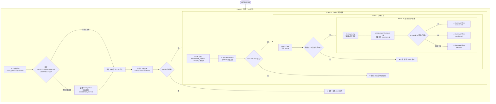
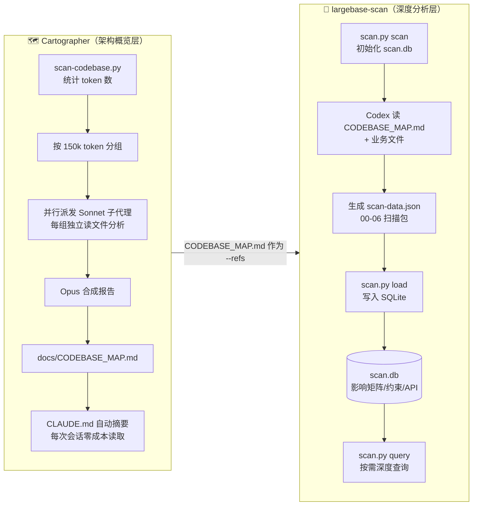
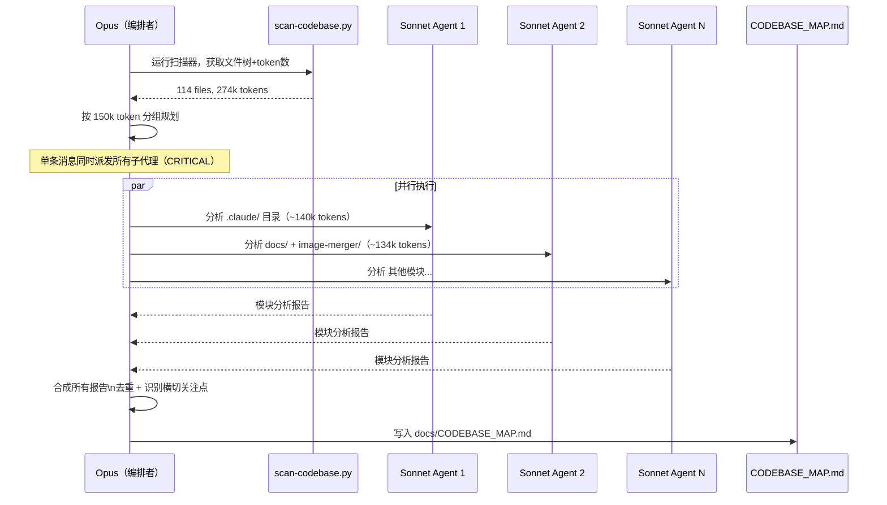
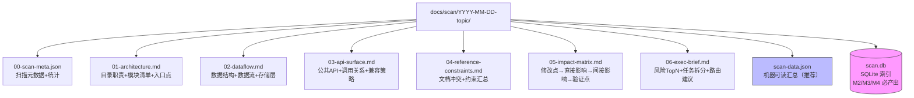

# largebase-structured-scan — 大型代码库结构化扫描

## 目标流程总览

本 skill 与 Cartographer 插件协同工作，分两层完成代码库扫描：

- **Cartographer**：架构概览层，并行 Sonnet 子代理读文件 → 生成 `docs/CODEBASE_MAP.md` → 写入 `CLAUDE.md`，每次会话零成本获取上下文
- **largebase-structured-scan**：深度分析层，Codex 生成结构化 JSON → SQLite 索引 → 影响矩阵 + 约束校验，支持按需深度查询

---

## 完整执行流程



---

## Cartographer 与 largebase-scan 分工



---

## 并行扫描架构（Cartographer 内部）



---

## 扫描产物结构



---

## 扫描模式选择

| 模式 | 使用时机 | 输出文件 | 成本 |
|------|---------|----------|------|
| M1 | 新功能接入，摸清目录与入口 | 00, 01, 06 | 低 |
| M2 | 涉及存储/索引/转换/同步 | 00, 01, 02, 05, 06 | 中 |
| M3 | 公共函数签名或模块契约变更 | 00, 01, 03, 05, 06 | 中 |
| M4 | 大规模重构或迁移 | 全部 00-06 + scan-data.json | 高 |

---

## 三层数据架构

<svg xmlns="http://www.w3.org/2000/svg" viewBox="0 0 600 320" width="600" height="320">
  <defs>
    <linearGradient id="g1" x1="0%" y1="0%" x2="100%" y2="0%">
      <stop offset="0%" style="stop-color:#4f46e5;stop-opacity:1"/>
      <stop offset="100%" style="stop-color:#7c3aed;stop-opacity:1"/>
    </linearGradient>
    <linearGradient id="g2" x1="0%" y1="0%" x2="100%" y2="0%">
      <stop offset="0%" style="stop-color:#0891b2;stop-opacity:1"/>
      <stop offset="100%" style="stop-color:#0284c7;stop-opacity:1"/>
    </linearGradient>
    <linearGradient id="g3" x1="0%" y1="0%" x2="100%" y2="0%">
      <stop offset="0%" style="stop-color:#059669;stop-opacity:1"/>
      <stop offset="100%" style="stop-color:#10b981;stop-opacity:1"/>
    </linearGradient>
  </defs>
  <rect x="40" y="20" width="520" height="80" rx="12" fill="url(#g1)"/>
  <text x="300" y="52" text-anchor="middle" fill="white" font-size="16" font-weight="bold" font-family="sans-serif">Layer 3：展示层</text>
  <text x="300" y="76" text-anchor="middle" fill="#e0e7ff" font-size="13" font-family="sans-serif">Markdown 报告（01-06）— 人类可读，IDE 直接查看</text>
  <text x="300" y="115" text-anchor="middle" fill="#6366f1" font-size="22" font-family="sans-serif">↑ 生成自</text>
  <rect x="40" y="130" width="520" height="80" rx="12" fill="url(#g2)"/>
  <text x="300" y="162" text-anchor="middle" fill="white" font-size="16" font-weight="bold" font-family="sans-serif">Layer 2：查询层</text>
  <text x="300" y="186" text-anchor="middle" fill="#e0f2fe" font-size="13" font-family="sans-serif">SQLite（scan.db）— 索引+联查，scan.py query 按需检索</text>
  <text x="300" y="225" text-anchor="middle" fill="#0891b2" font-size="22" font-family="sans-serif">↑ 加载自</text>
  <rect x="40" y="240" width="520" height="60" rx="12" fill="url(#g3)"/>
  <text x="300" y="266" text-anchor="middle" fill="white" font-size="16" font-weight="bold" font-family="sans-serif">Layer 1：存储层</text>
  <text x="300" y="286" text-anchor="middle" fill="#d1fae5" font-size="13" font-family="sans-serif">JSON（scan-data.json）— 机器可读，Codex 生成，schema 校验</text>
</svg>

---

## 执行命令速查

```bash
# Step 1：初始化扫描目录
python .claude/skills/largebase-structured-scan/scan.py scan \
  --mode M4 \
  --scope .claude docs image-merger \
  --topic codebase-full-scan \
  --refs docs/CODEBASE_MAP.md

# Step 2：Codex 生成 scan-data.json（见 templates/codex-prompt-M4.txt）

# Step 3：写入 SQLite
python .claude/skills/largebase-structured-scan/scan.py load \
  --load docs/scan/YYYY-MM-DD-codebase-full-scan/scan-data.json \
  --db   docs/scan/YYYY-MM-DD-codebase-full-scan/scan.db

# Step 4：验证查询
python .claude/skills/largebase-structured-scan/scan.py query \
  --query hybrid_search \
  --type all \
  --db docs/scan/YYYY-MM-DD-codebase-full-scan/scan.db

# Step 5（可选）：摘要写入 CLAUDE.md
python .claude/skills/largebase-structured-scan/scan.py export-to-claude-md \
  --db docs/scan/YYYY-MM-DD-codebase-full-scan/scan.db \
  --claude-md CLAUDE.md
```

---

## 已知问题与修复状态

| 问题 | 状态 | 说明 |
|------|------|------|
| Cartographer 未安装 | ✅ 已修复 | git clone 到 `.claude/plugins/cartographer/` |
| tiktoken 缺失 | ✅ 已修复 | `pip install tiktoken` |
| pwsh 不可用 | ⚠️ 待修复 | `run_largebase_scan.ps1` 无法运行，需 Python 替代脚本 |
| bash hook 路径错误 | ⚠️ 待修复 | `.claude/plugins/` 下子 git 仓库导致 hook 路径解析失败 |
| Cartographer 串行派发 | ⚠️ 待修复 | 应在单条消息中同时派发所有 Sonnet 子代理 |
| Codex MCP 超时 | ⚠️ 待验证 | scan-data.json 尚未生成 |

---

## 反模式（避免）

| 错误做法 | 后果 | 正确做法 |
|---------|------|---------|
| 串行派发 Sonnet 子代理 | 扫描时间翻倍 | 单条消息并行派发所有子代理 |
| 扫描后继续全库 grep | 重复消耗上下文 | 直接查询 scan.db |
| 输出只有散文 | 无法自动化处理 | 强制 JSON + 表格 |
| 不做参考文档冲突检测 | 实现与文档不一致 | 必须产出 04 文档 |
| 未生成影响矩阵就改码 | 回归范围失控 | 先完成 05 文档 |
| scope_paths 使用 `.` | 引入 .git 等噪声 | 明确指定业务目录 |
