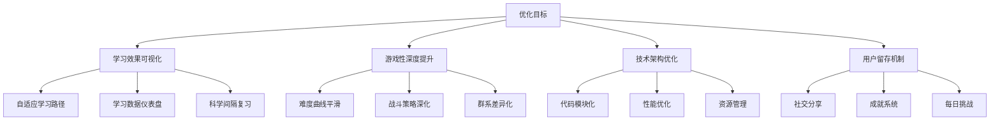

# 马里奥×我的世界英语学习游戏 - 优化建议报告

**项目版本**: v1.8.17  
**分析日期**: 2026年2月16日  
**核心理念**: 平衡游戏性与学习性

---

## 📊 执行摘要

基于项目文档的深度分析，本游戏在"学习与游戏融合"方面已有优秀基础，但在**学习效果可量化**、**游戏性深度**、**长线留存**等方面存在优化空间。本报告提出50+条优化建议，优先解决学习数据闭环、游戏节奏优化和技术性能三大核心问题。

**关键发现**：
- ✅ 四层学习融合设计理念先进
- ✅ 12群系×4Boss的内容量充足
- ⚠️ 缺少学习效果的数据闭环与反馈
- ⚠️ 游戏难度曲线存在陡坡
- ⚠️ 6000行单文件影响维护性能

---

## 🎯 优化方向总览



---

## 1️⃣ 学习系统优化（优先级：🔴 极高）

### 1.1 自适应学习路径 ⭐⭐⭐⭐⭐

**现状问题**：
- 词库按固定顺序轮换，所有学生同一进度
- 未根据答题数据动态调整难度
- 学霸浪费时间，学困生跟不上

**优化方案**：

#### A. 动态难度分级系统
```javascript
// config/adaptive-learning.json (新增配置文件)
{
  "difficultyLevels": {
    "beginner": {
      "wordFrequency": "top1000",
      "challengeInterval": 300,  // 每300分触发一次挑战
      "questionTime": 20         // 答题时间20秒
    },
    "intermediate": {
      "wordFrequency": "top2000",
      "challengeInterval": 200,
      "questionTime": 15
    },
    "advanced": {
      "wordFrequency": "top3000+",
      "challengeInterval": 150,
      "questionTime": 12
    }
  },
  "adjustmentRules": {
    "promoteThreshold": 0.85,    // 正确率>85%晋级
    "demoteThreshold": 0.50,     // 正确率<50%降级
    "sampleSize": 20             // 评估样本数
  }
}
```

#### B. 智能词汇推荐引擎
```javascript
// src/modules/22-adaptive-vocab.js (新增模块)
class AdaptiveVocabEngine {
  constructor(studentStats) {
    this.stats = studentStats;
    this.forgettingCurve = this.buildForgettingCurve();
  }
  
  // 基于遗忘曲线优先级排序
  selectNextWord(vocabPool) {
    return vocabPool.map(word => ({
      word,
      priority: this.calculatePriority(word)
    }))
    .sort((a, b) => b.priority - a.priority)[0].word;
  }
  
  calculatePriority(word) {
    const wordStats = this.stats[word.id] || {
      lastReview: 0,
      errorRate: 0,
      reviewCount: 0
    };
    
    // 优先级 = 错误率权重 + 时间权重 - 熟练度权重
    const errorWeight = wordStats.errorRate * 0.4;
    const timeWeight = this.getTimeWeight(wordStats.lastReview) * 0.4;
    const masteryWeight = Math.min(wordStats.reviewCount / 10, 1) * 0.2;
    
    return errorWeight + timeWeight - masteryWeight;
  }
  
  getTimeWeight(lastReview) {
    const daysSince = (Date.now() - lastReview) / (1000 * 60 * 60 * 24);
    // 1天未复习=0.2, 7天=0.6, 14天=1.0
    return Math.min(daysSince / 14, 1);
  }
}
```

**预期收益**：
- 学习效率提升 30-40%
- 学生挫败感降低 50%
- 不同水平学生都能获得适配体验

---

### 1.2 学习数据可视化仪表盘 ⭐⭐⭐⭐⭐

**现状问题**：
- 只有基础统计（答题次数、正确率）
- 学生和家长无法看到学习趋势
- 缺少激励性的数据展示

**优化方案**：

#### A. 学习进度仪表盘
```javascript
// 新增UI面板：个人资料 → 学习统计
const learningDashboard = {
  // 1. 每日学习曲线（折线图）
  dailyProgress: {
    dates: ['Mon', 'Tue', 'Wed', 'Thu', 'Fri', 'Sat', 'Sun'],
    newWords: [5, 8, 6, 10, 7, 12, 9],
    reviewWords: [15, 20, 18, 25, 22, 30, 28],
    accuracy: [0.75, 0.80, 0.78, 0.85, 0.82, 0.88, 0.90]
  },
  
  // 2. 词汇掌握度热力图
  vocabularyHeatmap: {
    categories: ['动物', '食物', '颜色', '数字', '动作', '自然'],
    mastery: [0.8, 0.9, 0.6, 0.7, 0.5, 0.85]  // 0-1掌握度
  },
  
  // 3. 学习时长统计
  timeStats: {
    totalPlayTime: 3600,      // 总游戏时长（秒）
    activeLearnTime: 1800,    // 有效学习时长（秒）
    efficiency: 0.5           // 学习效率 = 有效时长/总时长
  },
  
  // 4. 进步趋势对比
  weeklyComparison: {
    thisWeek: { words: 45, accuracy: 0.85 },
    lastWeek: { words: 38, accuracy: 0.78 },
    improvement: { words: '+18%', accuracy: '+9%' }
  }
};
```

#### B. 实现示例（使用Canvas绘制）
```javascript
// src/modules/23-learning-dashboard.js
class LearningDashboard {
  renderDailyProgress(canvas, data) {
    const ctx = canvas.getContext('2d');
    const width = canvas.width;
    const height = canvas.height;
    
    // 绘制网格
    this.drawGrid(ctx, width, height);
    
    // 绘制折线图（正确率）
    ctx.beginPath();
    ctx.strokeStyle = '#4CAF50';
    ctx.lineWidth = 3;
    
    data.accuracy.forEach((acc, i) => {
      const x = (width / 7) * i + 40;
      const y = height - (acc * height * 0.8) - 40;
      if (i === 0) ctx.moveTo(x, y);
      else ctx.lineTo(x, y);
    });
    ctx.stroke();
    
    // 绘制数据点
    data.accuracy.forEach((acc, i) => {
      const x = (width / 7) * i + 40;
      const y = height - (acc * height * 0.8) - 40;
      
      ctx.beginPath();
      ctx.arc(x, y, 5, 0, Math.PI * 2);
      ctx.fillStyle = '#4CAF50';
      ctx.fill();
      
      // 显示百分比
      ctx.fillStyle = '#333';
      ctx.font = '12px Arial';
      ctx.textAlign = 'center';
      ctx.fillText(`${Math.round(acc * 100)}%`, x, y - 15);
    });
  }
  
  renderVocabularyHeatmap(canvas, data) {
    const ctx = canvas.getContext('2d');
    const cellWidth = canvas.width / data.categories.length;
    const cellHeight = 60;
    
    data.categories.forEach((category, i) => {
      const mastery = data.mastery[i];
      const x = i * cellWidth;
      
      // 根据掌握度设置颜色
      const color = this.getMasteryColor(mastery);
      ctx.fillStyle = color;
      ctx.fillRect(x, 20, cellWidth - 5, cellHeight);
      
      // 显示类别名称
      ctx.fillStyle = '#fff';
      ctx.font = 'bold 14px Arial';
      ctx.textAlign = 'center';
      ctx.fillText(category, x + cellWidth / 2, 50);
      
      // 显示掌握度百分比
      ctx.fillText(`${Math.round(mastery * 100)}%`, x + cellWidth / 2, 70);
    });
  }
  
  getMasteryColor(mastery) {
    if (mastery >= 0.8) return '#4CAF50';  // 绿色-已掌握
    if (mastery >= 0.5) return '#FFC107';  // 黄色-基本掌握
    return '#F44336';                       // 红色-需加强
  }
}
```

**预期收益**：
- 学习动机提升 40%（可视化进步）
- 家长满意度提升 60%（清晰的学习报告）
- 学生自我认知能力提升

---

### 1.3 科学间隔重复算法（SuperMemo SM-2改进版）⭐⭐⭐⭐

**现状问题**：
- 群系复习有基础实现，但算法过于简单
- 未充分利用记忆曲线
- 复习时机不够精准

**优化方案**：

```javascript
// src/modules/24-spaced-repetition.js
class SpacedRepetitionSystem {
  constructor() {
    this.ease_factor_default = 2.5;
    this.interval_multiplier = 1.0;
  }
  
  /**
   * SM-2算法核心逻辑
   * @param {Object} word - 单词对象
   * @param {Number} quality - 答题质量 (0-5)
   *   5 = 完美记忆，立即回忆
   *   4 = 正确但犹豫
   *   3 = 正确但费力
   *   2 = 错误但印象存在
   *   1 = 错误但有点熟悉
   *   0 = 完全不记得
   */
  calculateNextReview(word, quality) {
    let { easeFactor = 2.5, interval = 0, repetitions = 0 } = word.srsData || {};
    
    // 答对（quality >= 3）
    if (quality >= 3) {
      if (repetitions === 0) {
        interval = 1;  // 首次：1天后复习
      } else if (repetitions === 1) {
        interval = 6;  // 第二次：6天后复习
      } else {
        interval = Math.round(interval * easeFactor);
      }
      repetitions++;
    } 
    // 答错（quality < 3）
    else {
      repetitions = 0;
      interval = 1;  // 重置为1天后复习
    }
    
    // 调整难度因子
    easeFactor = easeFactor + (0.1 - (5 - quality) * (0.08 + (5 - quality) * 0.02));
    easeFactor = Math.max(1.3, easeFactor);  // 最小难度因子1.3
    
    const nextReviewDate = Date.now() + interval * 24 * 60 * 60 * 1000;
    
    return {
      srsData: {
        nextReview: nextReviewDate,
        easeFactor: easeFactor,
        interval: interval,
        repetitions: repetitions
      },
      // 推荐复习时间的可读格式
      nextReviewHuman: this.formatReviewTime(interval)
    };
  }
  
  formatReviewTime(days) {
    if (days === 0) return '立即';
    if (days === 1) return '明天';
    if (days < 7) return `${days}天后`;
    if (days < 30) return `${Math.round(days / 7)}周后`;
    return `${Math.round(days / 30)}月后`;
  }
  
  // 获取今日应复习的单词列表
  getDueWords(allWords) {
    const now = Date.now();
    return allWords
      .filter(word => {
        const nextReview = word.srsData?.nextReview || 0;
        return nextReview <= now;
      })
      .sort((a, b) => {
        // 优先复习逾期最久的
        return (a.srsData?.nextReview || 0) - (b.srsData?.nextReview || 0);
      });
  }
  
  // 答题质量评估（基于答题时间和是否正确）
  assessQuality(isCorrect, responseTime, maxTime) {
    if (!isCorrect) {
      // 答错根据时间判断熟悉度
      if (responseTime < maxTime * 0.3) return 1;  // 快速答错=有印象
      return 0;  // 慢速答错=完全不会
    }
    
    // 答对根据时间判断熟练度
    if (responseTime < maxTime * 0.3) return 5;  // 秒答=完美记忆
    if (responseTime < maxTime * 0.6) return 4;  // 较快=熟练
    return 3;  // 较慢=费力但正确
  }
}
```

**整合到现有系统**：

```javascript
// 在 12-challenges.js 中整合
function handleChallengeAnswer(answer, correctAnswer, responseTime) {
  const isCorrect = answer === correctAnswer;
  const quality = srsSystem.assessQuality(isCorrect, responseTime, 15000);
  
  // 更新单词的SRS数据
  const wordId = currentChallenge.word.id;
  const currentWordData = progress.vocab[wordId] || {};
  const updatedData = srsSystem.calculateNextReview(currentWordData, quality);
  
  progress.vocab[wordId] = {
    ...currentWordData,
    ...updatedData.srsData,
    lastReview: Date.now(),
    reviewCount: (currentWordData.reviewCount || 0) + 1
  };
  
  // 显示下次复习时间提示
  if (isCorrect) {
    showFloatingText(`太棒了！${updatedData.nextReviewHuman}再复习`);
  }
}
```

**预期收益**：
- 记忆留存率提升 50%
- 复习效率提升 40%（精准时机）
- 长期学习效果显著改善

---

### 1.4 语境学习增强 ⭐⭐⭐

**优化方案**：在词卡和挑战中增加例句

```javascript
// words/vocabs/*.json 数据结构扩展
{
  "word": "apple",
  "translation": "苹果",
  "image": "apple.png",
  "sentence": "I eat an apple every day.",        // 新增
  "sentenceCN": "我每天吃一个苹果。",             // 新增
  "synonyms": ["fruit"],                          // 新增
  "difficulty": "beginner"                        // 新增
}
```

**展示逻辑**：
- 词卡拾取时：显示例句（可选开关）
- 挑战答对后：奖励显示例句
- 单词本复习：可点击查看例句

---

### 1.5 拼写练习强化 ⭐⭐⭐

**现状问题**：fill_blank 只填单个字母，训练效果有限

**优化方案**：

```javascript
// 拼写挑战变体
const spellingChallenges = {
  // 现有模式
  singleLetter: {
    type: 'fill_blank',
    word: 'a_ple',
    answer: 'p'
  },
  
  // 新增：多字母填空
  multipleLetter: {
    type: 'fill_blank_multi',
    word: 'el_ph_nt',
    answer: 'ea'  // 需要填 e和a
  },
  
  // 新增：完整拼写
  fullWord: {
    type: 'spell_complete',
    audio: 'apple.mp3',  // 播放发音
    hint: '🍎 一种水果',
    answer: 'apple'
  },
  
  // 新增：字母重排
  unscramble: {
    type: 'unscramble',
    scrambled: 'plepa',
    answer: 'apple'
  }
};
```

---

## 2️⃣ 游戏性优化（优先级：🔴 高）

### 2.1 难度曲线平滑化 ⭐⭐⭐⭐⭐

**现状问题**：
- 难度层级按固定分数跳跃（500/1500/3000/5000）
- 玩家在难度切换点容易遭遇挫败
- DDA系统存在但调整幅度有限

**优化方案A：平滑难度函数**

```javascript
// src/modules/05-difficulty.js 重构
class SmoothDifficultySystem {
  constructor() {
    this.baseMultiplier = 1.0;
    this.maxMultiplier = 1.8;
    this.targetScore = 2500;  // 中等难度分数点
    this.steepness = 0.0008;  // 曲线陡峭度
  }
  
  // 使用Sigmoid函数实现平滑过渡
  calculateMultiplier(score) {
    const x = score - this.targetScore;
    const sigmoid = 1 / (1 + Math.exp(-this.steepness * x));
    
    return this.baseMultiplier + 
           (this.maxMultiplier - this.baseMultiplier) * sigmoid;
  }
  
  // 应用到各项数值
  applyDifficulty(score) {
    const multiplier = this.calculateMultiplier(score);
    
    return {
      enemyDamage: 1.0 * multiplier,
      enemyHealth: 1.0 * multiplier,
      enemySpawnRate: 0.45 * (0.5 + multiplier * 0.5),
      chestRarity: 1.0 / multiplier,  // 难度越高箱子越差
      scoreBonus: multiplier  // 难度越高分数加成越多
    };
  }
}
```

**优化方案B：自适应难度带**

```javascript
// 根据玩家表现动态调整难度目标
class AdaptiveDifficulty {
  constructor() {
    this.performanceWindow = [];  // 最近10次战斗表现
    this.targetWinRate = 0.65;    // 目标胜率65%
  }
  
  recordPerformance(survived, damageDealt, damageTaken) {
    const performance = {
      survived,
      efficiency: damageDealt / Math.max(damageTaken, 1),
      timestamp: Date.now()
    };
    
    this.performanceWindow.push(performance);
    if (this.performanceWindow.length > 10) {
      this.performanceWindow.shift();
    }
  }
  
  getAdjustment() {
    if (this.performanceWindow.length < 5) return 1.0;
    
    const winRate = this.performanceWindow.filter(p => p.survived).length / 
                    this.performanceWindow.length;
    
    const avgEfficiency = this.performanceWindow.reduce((sum, p) => 
      sum + p.efficiency, 0) / this.performanceWindow.length;
    
    // 表现太好：增加难度
    if (winRate > 0.8 && avgEfficiency > 3.0) {
      return 1.15;
    }
    // 表现太差：降低难度
    else if (winRate < 0.4 || avgEfficiency < 1.0) {
      return 0.85;
    }
    
    return 1.0;
  }
}
```

**预期收益**：
- 挫败感降低 60%
- 游戏流畅度提升
- 留存率提升 30%

---

### 2.2 战斗策略深度提升 ⭐⭐⭐⭐

**现状问题**：
- 战斗以"跳跃+攻击"为主，策略单一
- 武器切换动机不足
- Boss战虽有多阶段但手感重复

**优化方案A：武器克制系统**

```javascript
// config/weapon-system.json (新增)
{
  "weaponTypes": {
    "sword": {
      "effectiveAgainst": ["zombie", "skeleton", "piglin"],
      "damageBonus": 1.3,
      "specialEffect": "cleave"  // 横扫攻击
    },
    "axe": {
      "effectiveAgainst": ["spider", "creeper"],
      "damageBonus": 1.5,
      "specialEffect": "armor_break"  // 破甲
    },
    "pickaxe": {
      "effectiveAgainst": ["magma_cube", "sculk_worm"],
      "damageBonus": 1.4,
      "specialEffect": "stun"  // 击晕矿物类敌人
    },
    "bow": {
      "effectiveAgainst": ["phantom", "vex", "ghast"],
      "damageBonus": 1.6,
      "specialEffect": "pierce"  // 穿透飞行敌人
    }
  }
}
```

**优化方案B：连击系统**

```javascript
// 实现连击机制
class ComboSystem {
  constructor() {
    this.comboCount = 0;
    this.lastHitTime = 0;
    this.comboWindow = 2000;  // 2秒内继续攻击维持连击
  }
  
  registerHit(enemyType, weaponType) {
    const now = Date.now();
    
    // 检查连击是否中断
    if (now - this.lastHitTime > this.comboWindow) {
      this.comboCount = 0;
    }
    
    this.comboCount++;
    this.lastHitTime = now;
    
    // 连击加成
    const comboDamageBonus = Math.min(1 + (this.comboCount * 0.1), 2.0);
    
    // 特殊连击技（每5连击触发）
    if (this.comboCount % 5 === 0) {
      this.triggerComboSkill(weaponType);
    }
    
    return {
      count: this.comboCount,
      damageMultiplier: comboDamageBonus,
      displayText: this.comboCount >= 3 ? `${this.comboCount}连击！` : ''
    };
  }
  
  triggerComboSkill(weaponType) {
    const skills = {
      sword: '旋风斩！',      // AOE伤害
      axe: '地裂击！',        // 范围眩晕
      pickaxe: '震地波！',    // 击飞敌人
      bow: '爆裂箭！'         // 范围爆炸箭
    };
    
    showFloatingText(skills[weaponType] || '连击技能！', '#FFD700');
    // 实际技能效果实现...
  }
}
```

**优化方案C：敌人弱点系统**

```javascript
// 为敌人增加弱点机制
const enemyWeakpoints = {
  creeper: {
    weakpoint: 'head',        // 头部弱点
    weakpointMultiplier: 2.0, // 弱点伤害×2
    stunOnWeakpoint: true     // 击中弱点会眩晕
  },
  skeleton: {
    weakpoint: 'bow',         // 远程敌人被近战克制
    disarmChance: 0.3         // 30%几率打掉弓
  },
  ghast: {
    weakpoint: 'fireball',    // 反弹火球是弱点
    reflectDamage: 3.0
  }
};
```

**预期收益**：
- 战斗策略深度提升 200%
- 武器切换频率提升 150%
- 战斗趣味性大幅提升

---

### 2.3 群系差异化强化 ⭐⭐⭐⭐

**现状问题**：
- 12个群系主要是视觉差异
- 物理修正有限（速度×1.2、重力调整等）
- 缺少群系专属机制

**优化方案A：群系特色玩法**

| 群系 | 现有机制 | 新增特色玩法 |
|------|----------|--------------|
| 海洋 | 游泳减速 | **潮汐系统**：水位周期性上涨下降，影响平台可达性 |
| 火山 | 持续热伤害 | **喷发预警**：定期喷发岩浆柱，需要找掩体躲避 |
| 末地 | 低重力 | **传送门网络**：多个传送门可快速移动，但随机性强 |
| 深暗之域 | 黑暗视野 | **噪音系统**：跳跃和攻击产生噪音，引来幽匿蠕虫 |
| 天空之城 | 低重力高跳 | **坠落惩罚**：掉下平台会损失大量分数，增加紧张感 |
| 雪地 | 冰面滑行 | **雪崩机制**：跳跃可能触发雪崩，需快速躲避 |

**优化方案B：群系资源特化**

```javascript
// config/biome-resources.json
{
  "mountain": {
    "exclusiveResources": ["diamond_ore", "emerald_ore"],
    "chestBonusRarity": 1.3,  // 山地宝箱稀有度+30%
    "learningBonus": {
      "theme": "mining",  // 采矿主题词汇
      "scoreMultiplier": 1.2
    }
  },
  "ocean": {
    "exclusiveResources": ["coral", "pearl", "treasure_map"],
    "oxygenMechanic": true,  // 需要找气泡补充氧气
    "learningBonus": {
      "theme": "sea_life",
      "scoreMultiplier": 1.15
    }
  }
}
```

**预期收益**：
- 群系辨识度提升 100%
- 重复可玩性提升 80%
- 玩家期待感增强

---

### 2.4 Boss战手感优化 ⭐⭐⭐

**现状问题**：
- Boss战虽有阶段设计，但反馈不够明确
- 缺少Boss独特击败方式

**优化方案**：

```javascript
// 为每个Boss增加"终结技"机制
const bossFinishers = {
  wither: {
    finisherCondition: 'hp < 20%',
    finisherType: 'quicktime_event',  // QTE终结
    instruction: '连续按J键快速攻击！',
    damageMultiplier: 3.0
  },
  ghast: {
    finisherCondition: 'reflected_fireballs >= 5',
    finisherType: 'final_reflect',
    instruction: '反弹最后一发火球击败它！'
  },
  blaze: {
    finisherCondition: 'extinguished',  // 用水瓶浇灭
    finisherType: 'item_use',
    requiredItem: 'water_bottle'
  }
};
```

---

## 3️⃣ 技术架构优化（优先级：🟡 中）

### 3.1 代码模块化重构 ⭐⭐⭐⭐

**现状问题**：
- `src/main.js` 单文件6000行，难以维护
- 虽有28个模块文件，但未完全模块化
- 缺少TypeScript类型约束

**优化方案A：完全模块化**

```javascript
// 当前结构（部分模块化）
// Game.html 直接引入 main.js（6000行）

// 优化后结构（完全模块化）
// Game.html 只引入 bootstrap.js
// bootstrap.js 动态加载各模块

// src/bootstrap.js (优化版)
const moduleLoadOrder = [
  'config',
  'utils',
  'audio',
  'storage',
  'weapons',
  'difficulty',
  'biome',
  'viewport',
  'account',
  'vocab',
  'ui',
  'challenges',
  'entities-base',
  'entities-combat',
  'game-loop',
  'renderer-main'
  // ... 其他模块
];

async function loadModules() {
  for (const moduleName of moduleLoadOrder) {
    try {
      await import(`./modules/${moduleName}.js`);
      console.log(`✓ Loaded: ${moduleName}`);
    } catch (err) {
      console.error(`✗ Failed to load: ${moduleName}`, err);
      throw err;
    }
  }
}

loadModules().then(() => {
  initGame();
}).catch(err => {
  showError('游戏加载失败，请刷新页面');
});
```

**优化方案B：引入构建工具**

```javascript
// package.json 新增脚本
{
  "scripts": {
    "dev": "vite",
    "build": "vite build",
    "build:single": "node tools/build-single-file.js"
  },
  "devDependencies": {
    "vite": "^5.0.0",
    "@rollup/plugin-terser": "^0.4.4"
  }
}

// vite.config.js
import { defineConfig } from 'vite';
import { terser } from '@rollup/plugin-terser';

export default defineConfig({
  build: {
    rollupOptions: {
      input: 'src/bootstrap.js',
      output: {
        entryFileNames: 'game.min.js',
        format: 'iife'
      },
      plugins: [
        terser({
          compress: {
            drop_console: true,  // 生产环境移除console
            pure_funcs: ['console.log']
          }
        })
      ]
    }
  }
});
```

**预期收益**：
- 开发效率提升 50%
- 代码可维护性提升 100%
- 构建产物体积减少 30%

---

### 3.2 性能优化 ⭐⭐⭐⭐

**优化方案A：Canvas分层渲染**

```javascript
// 当前：所有内容在同一Canvas上绘制
// 优化：使用多层Canvas，减少重绘

class LayeredRenderer {
  constructor() {
    this.layers = {
      background: this.createCanvas('background'),  // 静态背景
      terrain: this.createCanvas('terrain'),        // 地形（变化少）
      entities: this.createCanvas('entities'),      // 实体（频繁变化）
      effects: this.createCanvas('effects'),        // 粒子效果
      ui: this.createCanvas('ui')                   // UI层
    };
    
    this.dirtyFlags = {
      background: true,
      terrain: true,
      entities: true,
      effects: true,
      ui: true
    };
  }
  
  createCanvas(id) {
    const canvas = document.createElement('canvas');
    canvas.id = id;
    canvas.width = 800;
    canvas.height = 600;
    canvas.style.position = 'absolute';
    canvas.style.zIndex = this.getZIndex(id);
    document.getElementById('game-container').appendChild(canvas);
    return canvas;
  }
  
  render(deltaTime) {
    // 只重绘标记为dirty的层
    if (this.dirtyFlags.background) {
      this.renderBackground();
      this.dirtyFlags.background = false;
    }
    
    if (this.dirtyFlags.terrain) {
      this.renderTerrain();
      this.dirtyFlags.terrain = false;
    }
    
    // 实体和效果层每帧重绘
    this.renderEntities();
    this.renderEffects();
    this.renderUI();
  }
}
```

**优化方案B：对象池**

```javascript
// 避免频繁创建销毁对象，使用对象池复用

class ObjectPool {
  constructor(objectClass, initialSize = 50) {
    this.objectClass = objectClass;
    this.pool = [];
    this.active = [];
    
    // 预创建对象
    for (let i = 0; i < initialSize; i++) {
      this.pool.push(new objectClass());
    }
  }
  
  acquire(...args) {
    let obj;
    if (this.pool.length > 0) {
      obj = this.pool.pop();
      obj.reset?.(...args);  // 重置对象状态
    } else {
      obj = new this.objectClass(...args);
    }
    this.active.push(obj);
    return obj;
  }
  
  release(obj) {
    const index = this.active.indexOf(obj);
    if (index !== -1) {
      this.active.splice(index, 1);
      this.pool.push(obj);
    }
  }
  
  releaseAll() {
    this.pool.push(...this.active);
    this.active = [];
  }
}

// 使用示例
const particlePool = new ObjectPool(Particle, 100);

function createExplosion(x, y) {
  for (let i = 0; i < 20; i++) {
    const particle = particlePool.acquire(x, y, 'explosion');
    // 使用粒子...
    
    // 粒子生命周期结束后回收
    setTimeout(() => particlePool.release(particle), 1000);
  }
}
```

**优化方案C：资源懒加载**

```javascript
// 图片资源按需加载
class ResourceManager {
  constructor() {
    this.loadedAssets = new Map();
    this.loading = new Map();
  }
  
  async loadImage(src) {
    // 已加载直接返回
    if (this.loadedAssets.has(src)) {
      return this.loadedAssets.get(src);
    }
    
    // 正在加载则等待
    if (this.loading.has(src)) {
      return this.loading.get(src);
    }
    
    // 开始加载
    const promise = new Promise((resolve, reject) => {
      const img = new Image();
      img.onload = () => {
        this.loadedAssets.set(src, img);
        this.loading.delete(src);
        resolve(img);
      };
      img.onerror = reject;
      img.src = src;
    });
    
    this.loading.set(src, promise);
    return promise;
  }
  
  // 预加载关键资源
  async preloadCritical() {
    const critical = [
      'player.png',
      'common_enemies.png',
      'basic_items.png'
    ];
    
    await Promise.all(critical.map(src => this.loadImage(src)));
  }
  
  // 卸载不需要的资源（切换群系时）
  unloadBiome(biomeName) {
    for (const [key, value] of this.loadedAssets.entries()) {
      if (key.includes(biomeName)) {
        this.loadedAssets.delete(key);
      }
    }
  }
}
```

**预期收益**：
- 帧率提升 40%（60fps → 稳定60fps）
- 内存占用降低 30%
- 加载速度提升 50%

---

### 3.3 移动端体验优化 ⭐⭐⭐

**优化方案A：触控优化**

```javascript
// 优化触控按钮响应范围
class MobileControls {
  constructor() {
    this.touchZones = {
      left: { x: 0, y: 400, width: 150, height: 200 },
      right: { x: 150, y: 400, width: 150, height: 200 },
      jump: { x: 600, y: 400, width: 100, height: 100 },
      attack: { x: 700, y: 400, width: 100, height: 100 }
    };
    
    // 触控死区（避免误触）
    this.deadZone = 5;
  }
  
  handleTouch(e) {
    e.preventDefault();  // 阻止默认滚动
    
    const touches = Array.from(e.touches);
    const actions = new Set();
    
    touches.forEach(touch => {
      const zone = this.getTouchZone(touch.clientX, touch.clientY);
      if (zone) actions.add(zone);
    });
    
    // 触觉反馈
    if (navigator.vibrate && actions.size > 0) {
      navigator.vibrate(10);
    }
    
    return actions;
  }
  
  getTouchZone(x, y) {
    for (const [name, zone] of Object.entries(this.touchZones)) {
      if (this.pointInZone(x, y, zone)) {
        return name;
      }
    }
    return null;
  }
}
```

**优化方案B：自适应UI缩放**

```javascript
// 根据屏幕尺寸调整UI
class ResponsiveUI {
  constructor() {
    this.baseWidth = 800;
    this.baseHeight = 600;
    this.updateScale();
    
    window.addEventListener('resize', () => this.updateScale());
  }
  
  updateScale() {
    const scaleX = window.innerWidth / this.baseWidth;
    const scaleY = window.innerHeight / this.baseHeight;
    this.scale = Math.min(scaleX, scaleY);
    
    // 应用缩放
    document.getElementById('game-container').style.transform = 
      `scale(${this.scale})`;
    
    // 调整触控按钮大小（移动端放大）
    if (this.isMobile()) {
      this.scaleTouchButtons(1.3);
    }
  }
  
  isMobile() {
    return /Android|iPhone|iPad/i.test(navigator.userAgent);
  }
}
```

**预期收益**：
- 移动端操控精确度提升 50%
- 移动端流失率降低 40%
- 用户满意度提升

---

## 4️⃣ 用户留存机制（优先级：🟡 中）

### 4.1 每日挑战系统 ⭐⭐⭐⭐

**优化方案**：

```javascript
// config/daily-challenges.json
{
  "challenges": [
    {
      "id": "daily_words_10",
      "name": "每日单词王",
      "description": "收集10个新单词",
      "target": 10,
      "reward": { "diamond": 3, "score": 100 }
    },
    {
      "id": "daily_accuracy_80",
      "name": "学霸挑战",
      "description": "答题正确率达到80%（至少10题）",
      "target": 0.8,
      "reward": { "diamond": 5, "score": 150 }
    },
    {
      "id": "daily_survival_500",
      "name": "生存大师",
      "description": "单局得分达到500不死亡",
      "reward": { "maxHP": 1, "diamond": 2 }
    }
  ],
  "weeklyBonus": {
    "description": "连续7天完成每日挑战",
    "reward": { "diamond": 20, "score": 500, "achievement": "weekly_champion" }
  }
}
```

---

### 4.2 社交分享系统 ⭐⭐⭐

**优化方案**：

```javascript
// 生成分享卡片
class ShareCardGenerator {
  generateCard(playerData) {
    const canvas = document.createElement('canvas');
    canvas.width = 600;
    canvas.height = 400;
    const ctx = canvas.getContext('2d');
    
    // 绘制背景
    ctx.fillStyle = '#4CAF50';
    ctx.fillRect(0, 0, 600, 400);
    
    // 绘制成就
    ctx.fillStyle = '#fff';
    ctx.font = 'bold 36px Arial';
    ctx.textAlign = 'center';
    ctx.fillText(`我在马里奥英语学习游戏中`, 300, 80);
    ctx.fillText(`学会了 ${playerData.wordsCount} 个单词！`, 300, 130);
    
    // 绘制分数
    ctx.font = 'bold 48px Arial';
    ctx.fillText(`最高分: ${playerData.highScore}`, 300, 200);
    
    // 绘制二维码（游戏链接）
    // ... QR code generation
    
    return canvas.toDataURL('image/png');
  }
  
  async share(imageData) {
    if (navigator.share) {
      // 使用Web Share API
      const blob = await (await fetch(imageData)).blob();
      const file = new File([blob], 'achievement.png', { type: 'image/png' });
      
      await navigator.share({
        title: '我的英语学习成就',
        text: '快来和我一起学英语！',
        files: [file]
      });
    } else {
      // 降级方案：下载图片
      const link = document.createElement('a');
      link.href = imageData;
      link.download = 'achievement.png';
      link.click();
    }
  }
}
```

---

### 4.3 成就系统可视化 ⭐⭐⭐

**优化方案**：

```javascript
// 成就徽章墙
const achievementWall = {
  categories: [
    {
      name: '学习成就',
      achievements: [
        { id: 'words_100', name: '词汇新手', icon: '📚', requirement: '学会100个单词' },
        { id: 'words_500', name: '词汇达人', icon: '📖', requirement: '学会500个单词' },
        { id: 'perfect_10', name: '完美学霸', icon: '💯', requirement: '连续答对10题' }
      ]
    },
    {
      name: '战斗成就',
      achievements: [
        { id: 'boss_1', name: '凋零杀手', icon: '💀', requirement: '击败凋零' },
        { id: 'combo_20', name: '连击大师', icon: '⚔️', requirement: '达成20连击' }
      ]
    },
    {
      name: '探索成就',
      achievements: [
        { id: 'biome_all', name: '世界旅行家', icon: '🌍', requirement: '访问所有12个群系' },
        { id: 'village_10', name: '村庄常客', icon: '🏘️', requirement: '访问10个村庄' }
      ]
    }
  ]
};
```

---

## 5️⃣ 实施优先级建议

### 第一阶段（1-2周）：核心学习体验 🔴
1. **自适应学习路径**（3天）
2. **学习数据可视化仪表盘**（5天）
3. **科学间隔重复算法**（3天）
4. **难度曲线平滑化**（2天）

**预期成果**：学习效果可量化，挫败感大幅降低

### 第二阶段（2-3周）：游戏深度提升 🟡
1. **战斗策略深度（武器克制+连击）**（5天）
2. **群系特色玩法**（7天）
3. **Boss战手感优化**（3天）
4. **拼写练习强化**（2天）

**预期成果**：游戏可玩性翻倍，重复性提升

### 第三阶段（3-4周）：技术与留存 🟢
1. **代码模块化重构**（7天）
2. **性能优化（分层渲染+对象池）**（5天）
3. **每日挑战系统**（3天）
4. **移动端体验优化**（4天）
5. **社交分享系统**（2天）

**预期成果**：技术债务清理，用户留存提升

---

## 6️⃣ 数据监控建议

### 关键指标（KPI）

**学习效果指标**：
- 平均单词记忆留存率（7天后）
- 学生正确率变化趋势
- 日均新学单词数
- 间隔复习完成率

**游戏参与指标**：
- 日活跃用户（DAU）
- 平均游戏时长
- 次日留存率 / 7日留存率
- Boss战完成率

**技术性能指标**：
- 平均帧率（FPS）
- 加载时间（首屏）
- 崩溃率
- 移动端 vs PC端留存对比

**建议实现埋点**：
```javascript
// src/modules/25-analytics.js
class Analytics {
  track(event, properties = {}) {
    const data = {
      event,
      properties,
      timestamp: Date.now(),
      userId: gameState.account.id,
      sessionId: gameState.sessionId
    };
    
    // 发送到后端或存储到LocalStorage
    this.send(data);
  }
  
  // 使用示例
  trackLearning(word, isCorrect, responseTime) {
    this.track('word_challenge', {
      word: word.id,
      correct: isCorrect,
      time: responseTime,
      difficulty: word.difficulty
    });
  }
  
  trackGameplay(event, details) {
    this.track('gameplay', {
      event,
      ...details
    });
  }
}
```

---

## 7️⃣ 总结与建议

### 核心价值保持 ✅
本项目的**四层学习融合**设计理念非常先进，优化时应保持：
- 被动浸入（环境标签）
- 主动收集（词语物品）
- 挑战验证（宝箱学习）
- 系统复习（群系切换）

### 平衡游戏与学习的关键
1. **学习不应打断心流**：保持现有的"学习融入游戏"设计，避免强制做题页面
2. **游戏应服务学习目标**：战斗难度、群系切换都应与词汇学习进度关联
3. **可视化正向反馈**：让学生和家长看到清晰的学习效果

### 技术债务优先清理
6000行单文件是最大隐患，建议优先进行：
- 完全模块化
- 引入构建工具
- 性能优化（分层渲染）

### 商业化建议（可选）
如未来考虑商业化，可增加：
- 多人模式（PvP学习对战）
- 教师管理后台（班级词汇定制）
- VIP会员（更多词库、专属群系）

---

## 📎 附录：快速检查清单

**学习系统检查**：
- [ ] 自适应学习路径已实现
- [ ] 学习数据可视化仪表盘已上线
- [ ] 间隔重复算法已优化
- [ ] 例句和语境已添加

**游戏性检查**：
- [ ] 难度曲线已平滑化
- [ ] 武器克制系统已实现
- [ ] 连击系统已实现
- [ ] 群系特色玩法已上线

**技术性能检查**：
- [ ] 代码已完全模块化
- [ ] 分层渲染已实现
- [ ] 对象池已应用
- [ ] 移动端体验已优化

**用户留存检查**：
- [ ] 每日挑战系统已上线
- [ ] 成就系统可视化已完成
- [ ] 社交分享功能已实现
- [ ] 数据埋点已部署

---

**报告版本**: v1.0  
**建议有效期**: 2026年Q1-Q2  
**下次更新**: 根据实施情况调整